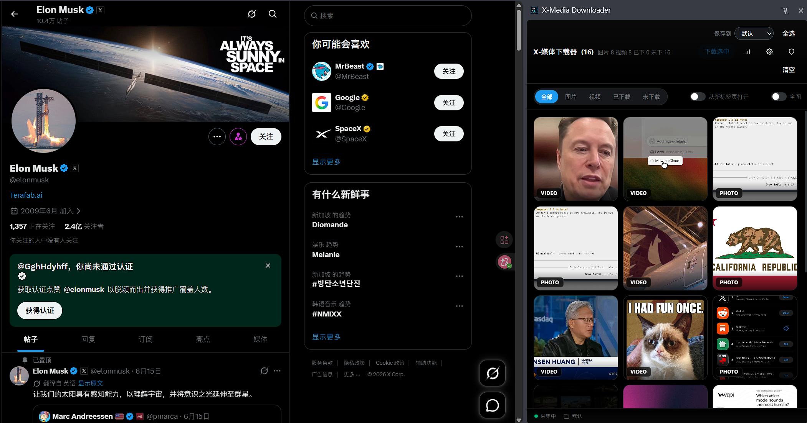

<div align="center">

# X-Media Downloader

[English](./README.en.md) | **简体中文**

一个强大的 Chrome 扩展，用于从 X.com (Twitter) 下载图片和视频，配备优雅的侧边栏 UI。

[](https://opensource.org/licenses/MIT)
[](https://developer.chrome.com/docs/extensions/)
[](https://developer.chrome.com/docs/extensions/mv3/intro/)
[](./package.json)
[](./CONTRIBUTING.md)

</div>

> 浏览时间线，捕获每个媒体，一键下载 —— 再也不错过任何一条推文。

---

## ✨ 功能特性

### 🎯 核心捕获
- **自动捕获** — 浏览时间线时自动拦截并捕获每张图片和视频
- **高质量** — 始终获取最佳可用质量（原图、最高码率视频）
- **实时同步** — 通过长连接 Port 通道，捕获的媒体即时显示在侧边栏

### 🖼️ 侧边栏 UI
- **精致网格视图** — 响应式媒体网格，带悬停效果、类型徽章和下载状态
- **智能筛选** — 按类型（图片/视频）或状态（已下载/未下载）筛选
- **灯箱预览** — 点击任意缩略图在全屏遮罩中预览
- **点击打开** — 开关切换：点击缩略图直接在新标签页打开媒体（浏览器原生查看器）
- **全图模式** — 切换到更大的缩略图布局，便于浏览

### ⚡ 批量与分类下载
- **多选** — 支持 Shift+点击范围选择多个项目
- **批量下载** — 一键下载所有选中项目
- **分类文件夹** — 将下载组织到自定义子文件夹（默认/真人/动漫）
- **单项快速下载** — 每个卡片都有各分类的快速下载按钮

### 🧠 智能去重（3 种模式）

| 模式 | 工作原理 | 能识别 |
|------|---------|--------|
| **ID**（默认） | 媒体 ID 匹配 | 同一推文内的同一媒体 |
| **封面 URL** | 标准化缩略图 URL | 不同用户转发的同一图片 |
| **感知哈希** | 64 位 pHash 指纹 | **盗图、重新上传、压缩副本、截图** |

所有去重模式均为设置面板中的可选开关。pHash 最为强大 —— 即使图片经过重新编码、缩放或裁剪，也能识别出视觉上相同的图片。

### � 下载中心（新增）
- **独立标签页** — 打开独立的下载中心标签页，管理所有下载任务
- **实时队列** — 跟踪每个任务的状态（等待中 / 下载中 / 已完成 / 失败）
- **失败重试** — 一键重试失败的下载任务
- **诊断面板** — 实时查看 `onDeterminingFilename` 监听器的命中情况，定位文件名未生效的根因
- **状态持久化** — 任务队列和映射存储在 `chrome.storage.session`，service worker 重启不丢失

### � 统计与历史
- **持久化历史** — 下载历史存储在 `chrome.storage.local`，浏览器重启不丢失
- **可视化热力图** — GitHub 风格的下载活跃度热力图
- **会话统计** — 跟踪当前会话的捕获和下载数量
- **自动标记重复** — 已下载项目自动显示绿色徽章

### 🕵️ 隐私与体验
- **老板键** — 一键隐私遮罩（伪装"页面找不到"界面）—— 按 `Esc` 触发
- **Toast 通知** — 所有操作的非侵入式反馈
- **设置面板** — 所有功能的集中配置入口

---

## 📸 截图



---

## 🚀 快速开始

### 从源码安装

```bash
# 1. 克隆仓库
git clone https://github.com/Nijika-jia/X-Media-Downloader.git
cd X-Media-Downloader

# 2. 安装依赖
npm install

# 3. 构建扩展
npm run build
```

**在 Chrome 中加载：**
1. 打开 `chrome://extensions/`
2. 启用右上角的**开发者模式**
3. 点击**加载已解压的扩展程序**
4. 选择 `dist/` 文件夹

### 使用方法

1. 访问 [x.com](https://x.com) 或 [twitter.com](https://twitter.com)
2. 浏览时间线 —— 媒体会自动捕获
3. 点击工具栏的扩展图标打开侧边栏
4. 筛选、选择、下载 —— 完成！

---

## ⚙️ 配置

所有设置可在 侧边栏 → 设置（齿轮图标）中找到：

| 设置 | 说明 | 默认值 |
|------|------|--------|
| **封面去重** | 按缩略图 URL 识别重复 | 关闭 |
| **感知哈希去重** | 按图片内容识别重复（可识别盗图/重新上传的图） | 关闭 |
| **点击打开** | 点击缩略图在新标签页打开媒体 | 关闭 |
| **全图模式** | 在网格中显示更大的缩略图 | 关闭 |
| **下载分类** | 下载的默认文件夹分类 | 默认 |
| **下载中心** | 点击侧边栏按钮打开独立下载管理标签页 | - |

---

## 🏗️ 架构

本项目采用**面向服务的架构**，配合依赖注入，灵感来自 [webextension-pixiv-toolkit](https://github.com/leoding86/webextension-pixiv-toolkit)。

```
┌─────────────────────────────────────────────────────────────┐
│                    Background (Service Worker)              │
│  ┌─────────────┐  ┌──────────────┐  ┌────────────────────┐  │
│  │ Application │─►│ ServiceProvider│─►│      服务层         │  │
│  │  (单例)     │  │  (DI 容器)    │  │ • Download         │  │
│  └─────────────┘  └──────────────┘  │ • History          │  │
│         │                            │ • Media (Port)     │  │
│         ▼                            │ • Setting          │  │
│  ┌─────────────┐                     │ • Tab              │  │
│  │  Bootstrap  │                     └────────────────────┘  │
│  └─────────────┘                                             │
└─────────────────────────────────────────────────────────────┘
         │ Port (长连接)              │ 消息
         ▼                            ▼
┌──────────────────────┐    ┌──────────────────────────────┐
│     Content Script   │    │        Side Panel UI         │
│  ┌────────────────┐  │    │  ┌────────────────────────┐  │
│  │   Lightbox     │  │    │  │   MediaStore (状态层)  │  │
│  └────────────────┘  │    │  └────────────────────────┘  │
│  ┌────────────────┐  │    │  ┌────────────────────────┐  │
│  │ Inject (MAIN)  │──┼────┼─►│  MediaGridRenderer     │  │
│  │ fetch/XHR 拦截 │  │    │  │       (视图层)         │  │
│  └────────────────┘  │    │  └────────────────────────┘  │
└──────────────────────┘    └──────────────────────────────┘
```

### 核心设计模式

- **Application 单例** — 中央控制器，管理服务生命周期和消息路由
- **Bootstrap 模式** — 处理初始化顺序和事件绑定
- **Service Provider (DI)** — 按需懒创建并注入服务
- **Port 通信** — 长连接用于实时媒体事件广播
- **数据-视图分离** — `MediaStore`（状态）+ `MediaGridRenderer`（视图）

---

## 📁 项目结构

```
src/
├── background/                # Service worker
│   ├── Application.js         # Application 单例（生命周期与路由）
│   ├── Bootstrap.js           # 初始化与事件绑定
│   └── services/
│       ├── AbstractService.js         # 服务基类
│       ├── AbstractPortService.js     # 基于 Port 的服务基类
│       ├── ServiceProvider.js         # DI 容器
│       ├── DownloadService.js         # 下载管理
│       ├── HistoryService.js          # 历史 + 去重（ID/URL/pHash）
│       ├── MediaService.js            # 媒体事件广播
│       ├── SettingService.js          # 设置管理
│       └── TabService.js              # 标签页管理
├── content/                   # Content script
│   ├── index.js               # 媒体拦截与灯箱触发
│   ├── Lightbox.js            # 灯箱遮罩
│   └── content.css
├── inject/                    # 注入脚本（MAIN world）
│   └── index.js               # 拦截 fetch/XHR 获取媒体 URL
├── sidepanel/                 # 侧边栏 UI
│   ├── index.js               # SidePanelApp 控制器
│   ├── MediaStore.js          # 状态管理（数据层）
│   ├── MediaGridRenderer.js   # 网格渲染（视图层）
│   ├── phash.js               # 感知哈希计算
│   ├── constants.js           # UI 常量与图标
│   ├── sidepanel.html
│   └── sidepanel.css
├── downloadcenter/            # 下载中心标签页（新增）
│   ├── index.js               # DownloadCenterApp 控制器
│   ├── downloadcenter.html
│   └── downloadcenter.css
├── popup/                     # 弹出页面
├── config/
│   └── default.js             # 默认设置
├── modules/
│   └── Extension/
│       └── browser.js         # 浏览器 API 适配器
└── errors/
    └── RuntimeError.js        # 自定义错误类
```

---

## 🛠️ 技术栈

| 类别 | 技术 |
|------|------|
| 平台 | Chrome Extension Manifest V3 |
| 语言 | 原生 JavaScript (ES6+) |
| 打包工具 | Webpack 5 |
| UI | 自定义 CSS（无框架） |
| 存储 | `chrome.storage.local` |
| API | `sidePanel`、`downloads`、`storage`、`runtime`、`tabs` |

---

## 💻 开发

```bash
# 安装依赖
npm install

# 开发模式（监听文件变化）
npm run dev

# 生产构建
npm run build
```

---

## 🤝 贡献

欢迎贡献！请随时提交 Pull Request。

1. Fork 本仓库
2. 创建功能分支 (`git checkout -b feature/amazing-feature`)
3. 提交更改 (`git commit -m 'Add some amazing feature'`)
4. 推送到分支 (`git push origin feature/amazing-feature`)
5. 发起 Pull Request

---

## 📝 许可证

本项目基于 [MIT License](LICENSE) 开源。

---

## 🙏 鸣谢

- [webextension-pixiv-toolkit](https://github.com/leoding86/webextension-pixiv-toolkit) — 架构灵感来源
- Chrome Extensions 团队提供的优秀 Manifest V3 API

---

<div align="center">

**如果这个项目对你有帮助，请考虑点个 ⭐！**

Made with ❤️ by [Nijika-jia](https://github.com/Nijika-jia)

</div>
